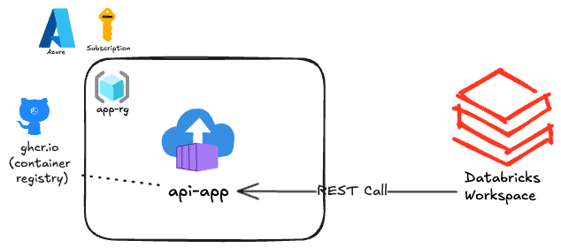

# Lab Description 

# Lab Set up

1. Fork the repository, create a devcontainer from the repository, the devcontainer has all tools you will need for the lab:
    - az cli
    - databricks cli
    - terraform

    Alternatively you can install all this locally on your machine.

2. Set up the lab. You will need 2 things:
    1) A place to deploy the container with [api-app](api-app/app.py): 
        - the image is published to the Github Container Registry: *ghcr.io/droidm128/databricks-api-data-enrichment/api-app:latest*
        - you can use this image and deploy to any place you like, for Azure deployment please refer to [terraform](terraform) folder and [az-deployment.sh](az-deployment.sh)
        - once deployed specify **api_url** parameter in [bundles/api-enrichment/resources/api-enrichment.job.yml](bundles/api-enrichment/resources/api-enrichment.job.yml)

    2) A Databricks workspace with a development cluster.
        - specify cluster_id in [databricks.yml](bundles/api-enrichment/databricks.yml)
        - connect to databricks from your machine: `databricks configure` 
            - provide you databricks host and personal access token
        - deploy the bundle:
        ```bash
        cd bundles/api-enrichment
        databricks bundle validate
        databricks bundle deploy
        ```
3. Once everything is set up you can run the pipelines
    - go to Databricks - Jobs & Pipelines  
    - run *[api-enrichment] generate-test-data-job*
    - run *[api-enrichment] execute-enrichment-job*
4. To check the resuls run the following select in a notebook:
    ```sql
    select * from hive_metastore.default.test_enriched_data 
    ```

# Architecture 



# References
- https://community.databricks.com/t5/technical-blog/understanding-pandas-udf-applyinpandas-and-mapinpandas/ba-p/75717
- https://docs.databricks.com/aws/en/udf/pandas 
- https://github.com/databricks/delta-live-tables-notebooks/blob/main/mapInPandas-dlt-ingestion/02_DLT_Pipeline.py